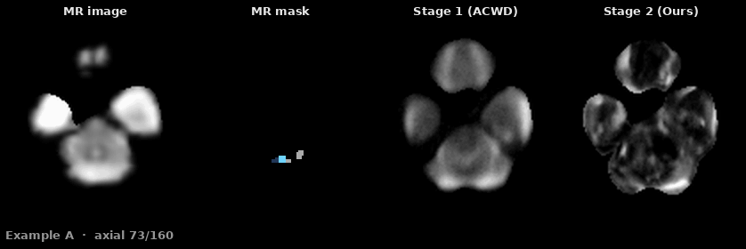
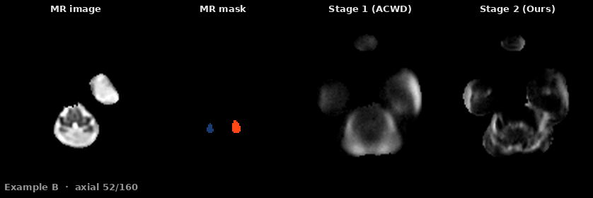
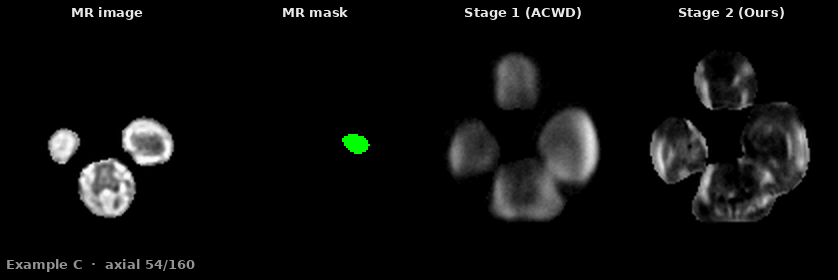

# AWR-Net

**Decoupling Anatomy and Appearance for 3D Fetal Brain Ultrasound Synthesis**

AWR-Net synthesizes 3D fetal brain ultrasound (US) volumes from anatomical masks in two
stages, trained on different data and in different domains:

| | Stage 1 — ACWD | Stage 2 — AARL |
|---|---|---|
| **Learns** | anatomical correspondence | ultrasound appearance |
| **Trained on** | clean US atlas image–mask pairs | real clinical US volumes |
| **Domain** | 3D Haar wavelet | image |
| **Output** | coarse volume `x̃` | bounded residual `Δx` → `x̂ = clip(x̃ + Δx)` |

Stage 1 is frozen while Stage 2 trains, and Stage 2 may only apply a bounded residual, so
appearance adaptation can change local intensity and texture but cannot redraw the anatomy
the mask specifies. Inference needs only a mask, so masks derived from fetal **MRI** —
normal or abnormal — can condition US synthesis without paired MRI–US data.

See the paper for the full method; each module docstring cites its equations.





Axial sweeps through three cases, each conditioned only on an MRI-derived mask: the source
MR volume, the anatomical mask that drives synthesis, the Stage-1 coarse output, and the
Stage-2 refinement. Example A is a normal brain; B and C carry ventriculomegaly of
increasing degree. The ventricular anatomy in the mask is preserved through both stages,
while Stage 2 adds the speckle, boundary contrast and depth-dependent attenuation that
make the volume read as ultrasound. No real ultrasound of these subjects exists — the mask
is the only input.

> **Status.** The two model packages (`awrnet/acwd/`, `awrnet/aarl/`) are released once
> the paper is accepted. Until then this repository carries the documentation, the shared
> utilities and the qualitative results.

## Setup

```bash
conda create -n awrnet python=3.10 -y && conda activate awrnet
pip install torch --index-url https://download.pytorch.org/whl/cu121   # match your CUDA
pip install -r requirements.txt

cp configs/paths.yaml.example configs/paths.yaml   # then edit the three roots
```

No source file contains an absolute path; everything resolves through
`configs/paths.yaml` (git-ignored), which sets `code_root`, `data_root` and `output_root`.
`AWRNET_PATHS=/path/to/other.yaml` switches configurations without editing anything.

Reference environment: Python 3.10, PyTorch 2.5.1, CUDA 12.1, one NVIDIA A100 80 GB.

## Data

All volumes are 160³ at 0.6 mm isotropic spacing, stored as NIfTI. These directories are
defaults — every script accepts an override — but following them lets the pipeline run
with no path arguments.

```
<data_root>/
├── US/Atlas/image/    <stem>.nii.gz          US atlas templates    (Stage 1 training)
├── US/Atlas/mask/     <stem>_label.nii.gz    matching label masks
├── US/Subject/image/  <stem>_US.nii.gz       real US volumes       (Stage 2 training)
├── US/Subject/mask/   <stem>_US_seg.nii.gz   anatomical masks
├── US/Subject/roi/    <stem>_US.nii.gz       binary brain ROI masks
├── MRI/mask/          <stem>.nii.gz          MRI-derived masks, same label space
└── splits/            train_subjects.csv, test_subjects.csv
```

**Split CSVs** (see `configs/split_template.csv`) need `image`; optionally `mask`
(default `<image stem>_seg.nii.gz`), `subject_id`, and — for Stage 2 —
`reliable_half_mask` (`L`, `R`, or empty for the whole ROI), naming the hemisphere with
reliable appearance. File names come from `image`/`mask`, never `subject_id`, so subjects
with several studies cannot overwrite one another.

**Labels** — background plus 13 structures, five bilateral; a left–right flip swaps the
pairs. Definitive mapping in [`awrnet/labels.py`](awrnet/labels.py).

| Label | Structure | | Label | Structure |
|---:|---|---|---:|---|
| 1 / 2 | cerebral hemisphere (CER) | | 8 / 9 | choroid plexus (CP) |
| 3 / 4 | cerebellar hemisphere (CBH) | | 10 | midbrain (MB) |
| 5 | vermis (VER) | | 11 | cavum septi pellucidi (CSP) |
| 6 / 7 | lateral ventricle (LV) | | 12 / 13 | deep central region (DCR) |

`DCR` merges the basal ganglia, thalamic region and adjacent deep white matter, which are
hard to separate reliably in 3D US. Map MRI protocols into this space first: cortical and
white-matter tissues into left/right `CER`, deep gray nuclei and thalamic regions into
`DCR`, and refine the brainstem label down to `MB`.

## Usage

```bash
bash bash/run_awrnet.sh                               # the whole pipeline
EXP_NAME=my_run bash bash/run_awrnet.sh               # name the run
STAGES="coarse_test refine" bash bash/run_awrnet.sh   # inference only
```

Five stages, each runnable alone via `STAGES`: `acwd` (train Stage 1) → `coarse_train`
(sample coarse volumes for the Stage-2 subjects) → `aarl` (train Stage 2) → `coarse_test`
(sample the eval split) → `refine` (apply Stage 2). Results land in
`<output>/acwd/<exp>/coarse_test/` and `<output>/aarl/<exp>/synthesis_test/refined/`.
`ACWD_ARCH` is forwarded to both ACWD training and sampling so the architecture always
matches; `ACWD_EXTRA`, `AARL_EXTRA` and `APPLY_EXTRA` pass flags to individual scripts.

Or run the scripts directly:

```bash
python scripts/train_acwd.py  --exp_name acwd_atlas
python scripts/sample_acwd.py --checkpoint <out>/acwd/acwd_atlas/checkpoints/acwd_050000.pt \
                              --mask_dir <data>/MRI/mask --output_dir <out>/coarse_mri
python scripts/train_aarl.py  --exp_name aarl \
                              --train_csv <data>/splits/train_subjects.csv \
                              --coarse_dir <out>/acwd/acwd_atlas/coarse_train
python scripts/apply_aarl.py  --checkpoint <out>/aarl/aarl/checkpoints/best.pt \
                              --csv <data>/splits/test_subjects.csv \
                              --coarse_dir <out>/acwd/acwd_atlas/coarse_test \
                              --out_dir <out>/aarl/aarl/synthesis_test
```

`--help` lists every flag; the useful ones are `--data_mode {atlas,real,mixed}` and the
loss weights `--grad_loss_weight / --boundary_loss_weight / --anchor_weight` for Stage 1,
and `--residual_scale` (ρ), `--refinement_mode {residual,direct}` and `--lam_adv` for
Stage 2. Setting a loss weight to `0` reproduces that loss ablation. Each run directory
gets `config.json`, `metrics.jsonl`, and `tb/` if TensorBoard is installed.

Two things worth knowing: `sample_acwd.py` takes the architecture from its **own flags**,
not the checkpoint, so pass the training values (or set `ACWD_ARCH`) — `apply_aarl.py`
reads its architecture back from the checkpoint and cannot drift. And `apply_aarl.py`
never opens a real ultrasound volume, so refined outputs for evaluation subjects carry no
information from their references.

## Acknowledgements

Builds on [guided-diffusion](https://github.com/openai/guided-diffusion) (MIT, Stage-1
U-Net and diffusion), [WaveCNet](https://github.com/LiQiufu/WaveCNet) (CC BY-NC-SA 4.0,
3D Haar DWT/IDWT) and [pix2pix](https://github.com/phillipi/pix2pix) (Stage-2 PatchGAN).
